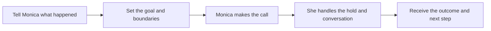

# Monica 📞

## Stop spending your day on hold.

You have already explained the problem twice. The chatbot sent a link that does not help. The agent says, “You’ll need to call another department,” and the only time you have to do it is your lunch break.

That is when you call Monica.

Monica is an AI customer-service agent that calls on your behalf. Give her the facts, the outcome you want, and the line she should not cross. She waits on hold, explains the problem, pushes for the next step, and brings you back a real answer.

> You have better things to do than hear “your call is important to us” for 47 minutes.

## The calls you keep putting off

### The hotel room from hell

The room had pests. The front desk promised to “look into it.” Two weeks later, the charge is still on your card. Tell Monica what happened, your reservation number, and the refund you think is fair. She calls the property, asks for a manager, gets the complaint on record, and comes back with the answer—or a clear escalation path.

### The charge that showed up out of nowhere

Your phone bill is suddenly $180 higher. You know the answer will involve a maze of menus, a transfer, and someone reading policy language at you. Monica gets through the menu, asks for a line-by-line explanation, challenges the error, and tells you whether the charge was reversed and when it will appear.

### The insurance denial nobody can explain

You received a denial letter full of jargon and no useful next step. Monica calls to ask why the claim was denied, what documents are missing, and whether it can be reopened for review. She gets the case number, records the representative’s answer, and returns with exactly what you need to do next.

### The refund that is “processing” forever

The company said five to seven business days. It has been three weeks. Monica follows up, asks for the status and a reference number, and presses for a concrete resolution instead of another vague promise.

Monica also helps with travel issues, subscriptions, service complaints, manager escalations, and any situation where a company has made you do the chasing.

Monica works from a call brief: the company, what happened, the resolution you want, and the limits of what she is authorized to agree to.

## The experience

1. **Hand over the headache.** Tell Monica what happened, share the relevant reference numbers, and say what a good outcome looks like.
2. **Set the guardrails.** Tell her what she can ask for and what needs your approval.
3. **Let Monica make the call.** She identifies herself as an AI calling with your permission, handles the hold music, transfers, and conversation.
4. **Get the answer.** Follow the live transcript or wait for Monica’s clear summary: what happened, what she needs from you, and what comes next.

When a representative makes an offer that needs your approval, Monica pauses and asks rather than accepting on your behalf.

## Made to be on your side

Monica is designed to be persistent, clear, and bounded by your instructions.

- **You set the limits.** Define what Monica may request and what requires your approval.
- **No surprise outreach.** Calls and text updates use verified, consented numbers only.
- **Transparent identity.** Monica identifies herself as an AI agent acting with the customer’s permission.
- **A record of the conversation.** Review the live transcript and the final call summary instead of relying on a vague “we’ll look into it.”

## What you tell Monica

> “My hotel room was unusable, and the property has ignored my complaint. Ask for a partial refund, get a case number, and do not accept any offer without asking me first.”

Monica turns that into a focused conversation with the hotel. She follows the transfers, stays on hold, asks for the appropriate escalation, and returns with an outcome—not just a transcript.

## Current prototype

The prototype supports real outbound, consented calls; live call history; structured case notes; approval requests; and iMessage-first result notifications with SMS fallback. It is currently focused on customer-service calls, not inbound callbacks.

## For builders

Want to run or extend Monica? Start with the [local development guide](docs/LOCAL_DEVELOPMENT.md). It covers the voice setup, consented test calls, and required environment configuration.

Additional implementation references:

- [API overview](docs/API.md)
- [Call history and follow-up flow](docs/call-history.md)
- [SMS notifications and consent](docs/sms-notify.md)
- [Monica identity for Messages](docs/monica-identity.md)

---

*Built at a hackathon, fueled by refund-denial rage.*
