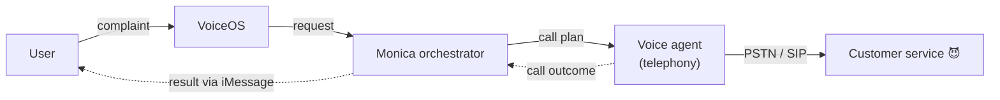

# Monica 📞

**Your AI big sis who yells at customer service so you don't have to.**

Ever called an insurance company 10 times to get a refund, and got denied every single time? So did we. That's why we built Monica — an AI voice agent that calls customer service on your behalf, argues your case, survives the hold music, and texts you the result.

> we made a website called **myinsurancecompanydidnotrefundmymoney.com** — Monica lives there.

## What Monica does

- **Takes your request through VoiceOS** — complain to VoiceOS ("get my refund from X", "book me a hotel", "ask if my insurance covers this") and it routes the request to Monica
- **Dials the company for you** — real outbound phone calls, not emails into the void
- **Chats fluently with human agents** — handles follow-up questions, pushback, and "let me transfer you"
- **Survives holds** — Monica waits on hold; you don't
- **Schedules follow-up calls** — if the agent says "call back tomorrow", Monica actually does
- **Reports back** — you get an iMessage with the outcome (refund approved 🎉 / denied, here's why, here's the next move)

## How it works



*Solid arrows: request path. Dashed arrows: results flowing back.*

The flow, end to end:

1. **User → VoiceOS** — the user complains to VoiceOS; VoiceOS routes the request to Monica
2. **Monica orchestrator** — turns the request into a call plan (who to call, what to claim, what evidence to cite)
3. **Voice agent** — LLM-driven conversation over a real phone call: dials, argues the case, handles follow-up questions, survives holds, schedules retries
4. **Result → iMessage** — the call outcome flows back through Monica, and the user gets status updates and the final verdict over iMessage

Telephony runs on a SIP trunk / voice webhook (Telnyx-backed). Numbers must be OTP-verified before Monica can call or text them — no cold outreach, consent first.

## Setup

Credentials live in environment variables — **never commit them**:

```bash
cp .env.example .env
```

```env
A1_TEAM_KEY=team-xxxxxxxxxxxx        # your a1mobile team key
A1_PHONE_NUMBER=+1xxxxxxxxxx         # Monica's outbound number
SIP_USERNAME=xxxxxxxx                # SIP trunk creds (sip.telnyx.com)
SIP_PASSWORD=xxxxxxxx
```

Point the number's voice webhook at your server, then place calls:

```bash
# wire the number to your voice server
curl -X POST https://hack.a1mobile.com/api/numbers/point \
  -H "X-Team-Key: $A1_TEAM_KEY" -H "Content-Type: application/json" \
  -d '{"webhook_url":"https://YOUR-SERVER/voice"}'

# outbound call — your webhook drives the conversation on answer
curl -X POST https://hack.a1mobile.com/api/calls \
  -H "X-Team-Key: $A1_TEAM_KEY" -H "Content-Type: application/json" \
  -d '{"to":"+1NUMBER"}'
```

## Demo

1. Complain to VoiceOS: *"my insurance denied my refund again, fight them"* — it routes the request to Monica
2. Monica calls the (mock) insurance company, argues the case, handles follow-ups and holds
3. You get the play-by-play and the final verdict back in iMessage

## Docs

- [docs/sms-notify.md](docs/sms-notify.md) — the result-notification leg: API walkthrough, OTP consent flow, and how the SMS chain works under the hood (**live-tested ✅**)
- [docs/monica-identity.md](docs/monica-identity.md) — making the sender show up as **Monica** with her avatar (contact card / vCard / iMessage profile)
- [docs/a1mobile.md](docs/a1mobile.md) — platform API reference (numbers, voice, SMS, MCP)

Helper scripts (all read `A1_TEAM_KEY` from the environment):

```bash
./scripts/verify-number.sh +1XXXXXXXXXX          # one-time consent OTP for a recipient
./scripts/verify-number.sh +1XXXXXXXXXX 123456   # confirm the code
./scripts/notify.sh +1XXXXXXXXXX "Refund approved 🎉 $200"
./scripts/make-vcard.sh                          # build Monica's contact card (needs assets/monica-avatar.jpg)
```

## Roadmap

- [ ] Voice agent API research & integration
- [x] Result notification via SMS — working, see [docs/sms-notify.md](docs/sms-notify.md)
- [ ] iMessage (blue bubble) upgrade for notifications — Mac bridge, see [docs/monica-identity.md](docs/monica-identity.md) Option 3
- [ ] Monica's avatar + name on the user's phone — see [docs/monica-identity.md](docs/monica-identity.md)
- [ ] Infra connecting notifications ↔ voice
- [ ] Mock agencies (insurance / hotel) for testing
- [ ] End-to-end integration + QA
- [ ] Demo video

Out of scope for now: receiving inbound call-backs from customer service.

---

*Built at a hackathon, fueled by refund-denial rage.*
